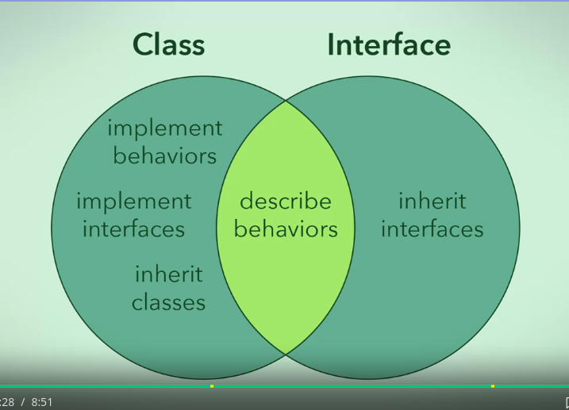

## Keynotes on object oriented modeling.

### Generalization using inheritance

- Superclasses are generlised classes and subclasses are specialized classes.
- Protected(in uml uses a #) accessmodifier means attribute is accessesible
	- in encapsulating class itself	
	- to all subclasses
	- to all other classes under the same package(namespace)
- Diamond sign identifies the whole part object in UML design.
	- If diamond is filled its called aggregation relation to part objects from whole objects.
	- If diamond is not filled its called composition relation to part objects from whole objects.
- If the Superclass has explicit constructor, the subclass constructor must call its superclass's constructor by `super()`.

### Generalization using interface

- Interfaces are not classes and they are used to describe behaviour
- All that interface contain are method signatures.Its like a contract.
- Interfaces only consists method signatures.
```java
public interface IAnimal{
	public void move();
	public void speak();
	public void eat();
}
```
- Class implementing IAnimal must implement all its method signatures as contracted.
- Interfaces are described in UML using `<<interface>>` then interface name.
- Dotted arrow is shown for class implementing interface.
- Interfaces can extend each other.
```java
public interface 2d{
	public void movex();
	public void movey();
}

public interface 3d extends 2d{
	public void movez();
}
```

### Multiple Inheritence

- subclass has two or more superclasses!(Java does not support beacause of data ambiguity)
- but in java class can implement multiple interfaces as interface have method signature only.

### A beautiful Figure

